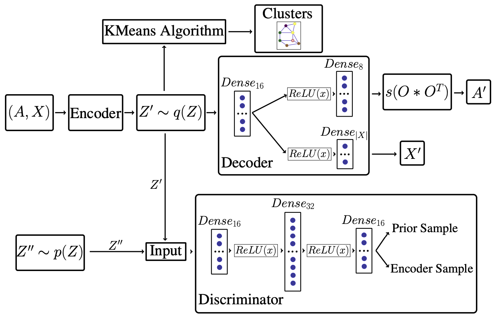
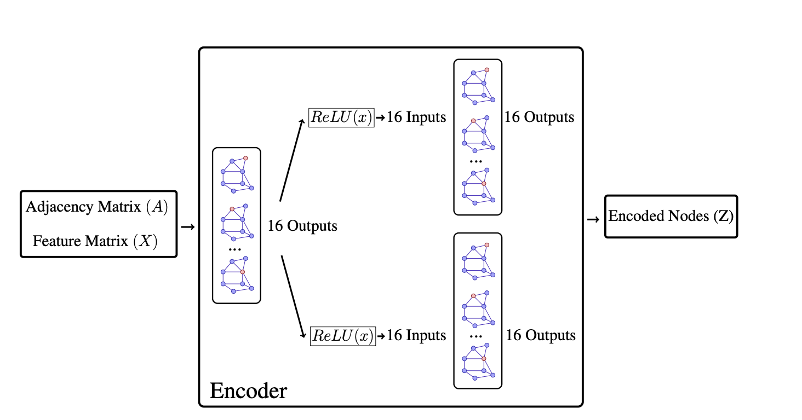

# GraphViNE

This is a pytoch implementation of the GraphViNE model as described in our paper:
Farzad Habibi, Mahdi Dolati, Ahmad Khonsar, & Majid Ghaderi. [Accelerating Virtual Network Embedding with Graph Neural Networks](http://dl.ifip.org/db/conf/cnsm/cnsm2020/1570659319.pdf), 16th International Conference on Network and Service Management (CNSM 2020)

Virtual Network Embedding (VNE) is an essential component of network virtualization technology. 
Prior works on VNE mainly focused on resource efficiency and did not address the scalability as a first-grade objective. Consequently, the ever-increasing demand and size render them less-practical.
The few existing designs for mitigating this problem either do not extend to multi-resource settings or do not consider the physical servers and network simultaneously.
In this work, we develop `GraphVine`, a parallelizable VNE solution based on spatial Graph Neural Networks (GNN) that clusters the servers to guide the embedding process towards an improved runtime and performance. 
Our experiments using simulations show that the parallelism of `GraphVine` reduces its runtime by a factor of $8$. Also, `GraphVine` improves the revenue-to-cost ratio by about $18\%$, compared to other simulated algorithms.


A scheme of our auto encoder can be shown as:

Auto Encoder:


Encoder:


## Requirements
* pytorch
* torch-scatter
* torch-sparse
* torch-cluster
* torch-geometric
* networkx

**Note:** 
  * You can easily install requirements by running this command:
  * We recommend to use python enviroment
```
chmod 755 requirements.sh
./requirements.sh
```

## Run the Demo
```
python compare_main --help
```

## Cite
Please cite our paper if you use this code in your own work:

```
@INPROCEEDINGS { Habi2011:Accelerating,
    AUTHOR="Farzad Habibi and Mahdi Dolati and Ahmad Khonsari and Majid Ghaderi",
    TITLE="Accelerating Virtual Network Embedding with Graph Neural Networks",
    BOOKTITLE="16th. International Conference on Network and Service Management",
    ADDRESS="Izmir, Turkey -- Virtual conference hosting Paris, France",
    DAYS=1,
    MONTH=nov,
    YEAR=2020
}
```


